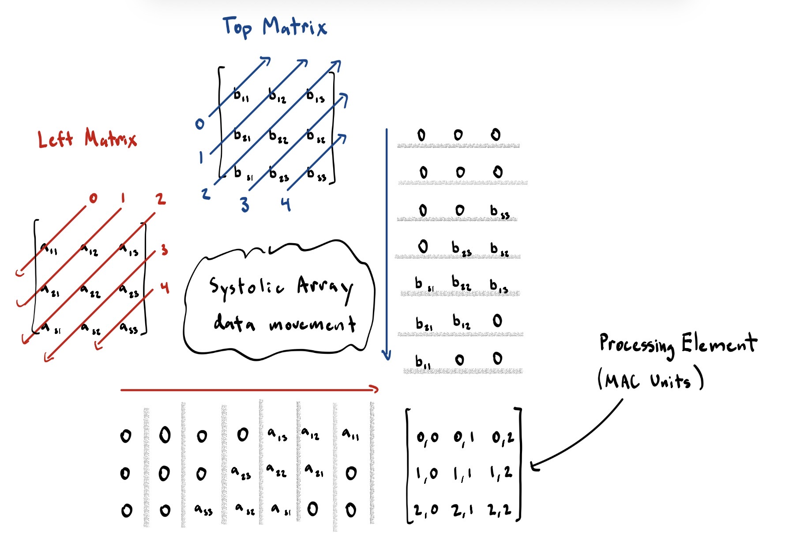

# AI Hardware Accelerator

A parameterized SystemVerilog matrix-multiplication accelerator built around a
two-dimensional systolic array. The integrated design accepts two signed
integer matrices, skews their values into a processing-element (PE) mesh,
accumulates the matrix product, optionally applies ReLU, and stores the result
one row per clock cycle.

The repository provides two separate top levels:

- `top.sv` uses signed-integer inputs and accumulators.
- `top_BF16.sv` uses 16-bit BF16 inputs, BF16 multiplication, and 32-bit IEEE-754 floating-point accumulation (FP32).

Both top levels reuse the controller, input-buffer skewing, optional ReLU, and
row-wise output-memory architecture.

## Features

- Parameterized `N x N` systolic array
- Signed integer multiply-accumulate datapath
- Full-matrix input buffering and wavefront skewing
- Controller-driven `IDLE`, `LOAD`, `COMPUTE`, `STORE`, and `DONE` phases
- Optional ReLU activation
- Row-wise output storage
- BF16 multiplication with FP32 accumulation
- TPU-style flushing of BF16 subnormal operands to zero
- Directed SystemVerilog testbenches
- UVM environment, SVA assertions, functional coverage, and VCS regression

## How the accelerator computes matrix multiplication



*A 3x3 example of the skewed A and B wavefronts entering a 3x3 grid of
processing elements. A values move horizontally from the left, B values move
vertically from the top, and zeros pad cycles in which no matrix value should
enter.*

The matrix-multiplication data path operates in four steps:

1. **Move matrices from storage into the input buffers.** In a complete
   accelerator system, an external or on-chip memory supplies matrices A and B
   to the input buffers. In the current RTL, those complete matrices arrive
   through the `top.sv` input ports and `load_enable` captures them into
   `buffer_A` and `buffer_B` in one clock cycle. The module currently named
   `MemoryBank` is the output result bank; a future streaming implementation
   can add a separate input-memory interface.

2. **Skew the buffered values into wavefronts.** Matrix elements cannot all
   enter the PE array simultaneously because A travels right while B travels
   down. `Input_Buffers` delays A row `r` by `r` cycles and B column `c` by
   `c` cycles. At feed cycle `t`, it generates:

   ```text
   left input for row r = A[r][t-r]
   top input for col c  = B[t-c][c]
   ```

   Values outside the valid matrix indices are replaced with zero. The
   staggered values form the diagonal wavefronts shown in the diagram and
   ensure that `A[row][k]` and `B[k][col]` meet at `PE(row,col)` during the
   same clock cycle.

3. **Multiply, accumulate, and forward in every PE.** Each processing element
   contains a multiplier, a local accumulator, and A/B forwarding registers.
   On every valid clock it performs:

   ```text
   local_accumulator += A_value * B_value
   forward A_value one PE to the right
   forward B_value one PE downward
   ```

   The array computes many products in parallel. PE `(row,col)` keeps its
   partial sum stationary until it has accumulated all `N` products:

   ```text
   C[row][col] =
       A[row][0] * B[0][col] +
       A[row][1] * B[1][col] +
       ... +
       A[row][N-1] * B[N-1][col]
   ```

4. **Drain, activate, and store the result.** After the input buffers finish
   feeding real values, the controller leaves the array enabled for `N-1`
   drain cycles so the final wavefront reaches the farthest PE. The completed
   accumulator matrix optionally passes through ReLU, and `MemoryBank` stores
   one result row per clock cycle.

This reuse of data is the central advantage of the systolic architecture:
each A value is reused across a PE row, each B value is reused down a PE
column, and all PEs perform multiply-accumulate operations concurrently
without repeatedly reading every operand from memory.

## Numeric datapaths

### Integrated BF16/FP32 path

The floating-point hierarchy is:

```text
top_BF16
├── controller
├── Input_Buffers (DATA_SIZE = 16)
├── Systolic_Array_BF16
│   └── ProcessingElement_BF16
│       └── bf16_mac
│           ├── bf16_multiplier
│           └── fp32_adder
├── ReLU (ACC_SIZE = 32)
└── MemoryBank (ACC_SIZE = 32)
```

BF16 operands use:

```text
1 sign bit | 8 exponent bits | 7 stored fraction bits
```

The multiplier reconstructs the implicit leading significand bit, multiplies
the two 8-bit significands, adds the exponents, normalizes the result, and
produces an FP32 product. BF16 zero and subnormal operands (`exponent == 0`)
are flushed to signed zero. NaN and infinity cases are handled explicitly.

The FP32 adder:

1. Unpacks both FP32 operands.
2. Selects the larger magnitude.
3. Aligns the smaller significand with `shift_right_jam`.
4. Adds equal-sign operands or subtracts opposite-sign operands.
5. Normalizes the result.
6. Rounds to nearest, ties to even, using guard, round, and sticky bits.
7. Packs a normal, subnormal, zero, infinity, or NaN FP32 result.

The current MAC is a multiplier followed by an adder, not a fused
floating-point FMA. Both blocks are combinational between PE accumulator
registers, which keeps the implementation understandable but creates a long
timing path.

### Integrated signed-integer path

The default parameters are:

```systemverilog
DATA_SIZE   = 8
ACC_SIZE    = 32
MATRIX_SIZE = 2
```

Each PE performs an `8-bit x 8-bit` signed multiplication, sign-extends the
16-bit product, and adds it to a signed 32-bit accumulator.


## Top-level interfaces

`top.sv` and `top_BF16.sv` share the same control protocol. Their matrix
interfaces differ only in numeric representation:

| Top level | A/B inputs | C output |
| --- | --- | --- |
| `top` | Parameterized signed integers; default 8 bits | Parameterized signed accumulator; default 32 bits |
| `top_BF16` | 16-bit BF16 encodings | 32-bit FP32 encodings |

| Signal | Direction | Description |
| --- | --- | --- |
| `clk` | Input | Accelerator clock |
| `rst_n` | Input | Active-low asynchronous reset |
| `start` | Input | Starts a new matrix operation from `IDLE` |
| `relu_enable` | Input | Selects ReLU for the operation; captured during `LOAD` |
| `input_A` | Input | Complete signed `N x N` matrix A |
| `input_B` | Input | Complete signed `N x N` matrix B |
| `output_C` | Output | Stored signed `N x N` result matrix |
| `done` | Output | One-cycle completion pulse |
| `store_done` | Output | Indicates that every output row has been stored |
| `state` | Output | Current controller state |

## Module guide

| File | Role |
| --- | --- |
| `top.sv` | Integrated signed-integer accelerator |
| `top_BF16.sv` | Integrated BF16-input, FP32-output accelerator |
| `controller.sv` | Generates load, compute, store, clear, valid, and done controls |
| `typedef.svh` | Defines the controller state type |
| `Input_Buffers.sv` | Captures A/B matrices and generates skewed edge vectors |
| `ProcessingElement.sv` | Signed-integer multiply-accumulate PE |
| `Systolic_Array.sv` | Parameterized signed-integer PE mesh |
| `ReLU.sv` | Optionally clamps negative accumulated values to zero |
| `MemoryBank.sv` | Stores the completed result one row per cycle |
| `bf16_pkg.sv` | BF16/FP32 types, constants, and classification helpers |
| `bf16_multiplier.sv` | BF16 multiply with an FP32 result |
| `fp32_adder.sv` | FP32 add/subtract, alignment, normalization, and rounding |
| `bf16_mac.sv` | Connects BF16 multiplication to FP32 accumulation |
| `ProcessingElement_BF16.sv` | BF16-input, FP32-accumulator PE |
| `Systolic_Array_BF16.sv` | Parameterized BF16 PE mesh |

## Current limitations and next steps

- Pipeline the BF16 multiplier and FP32 adder for a practical clock frequency.
- Add valid-pipeline tracking if floating-point arithmetic becomes multi-cycle.
- Extend the UVM environment and functional coverage to `top_BF16`.
- Run synthesis and static timing analysis against a target standard-cell or
  FPGA technology before claiming area, power, or maximum clock frequency.

